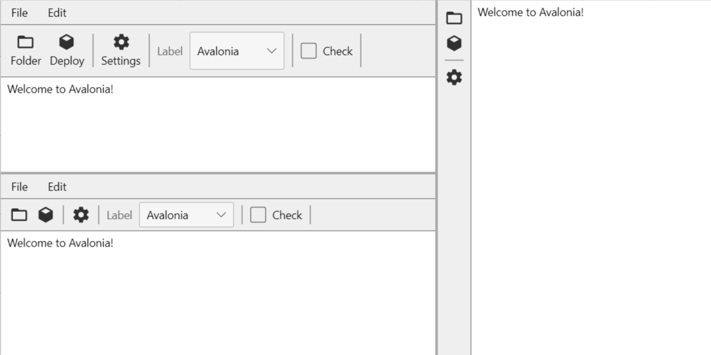

MiniToolbar.Avalonia
==========

**MiniToolbar.Avalonia** provides a minimalistic toolbar implementation for **[Avalonia](https://avaloniaui.net/)**.

### Documentation
There is currently only very limited documentation (incl. API docs) available. Please refer to the *DemoApp* for preliminary instructions and usage examples.

### License
MiniToolbar.Avalonia is licensed under the terms of the MIT license (<http://opensource.org/licenses/MIT>, see LICENSE.txt).
